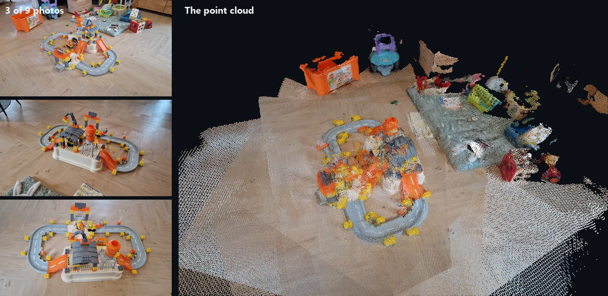
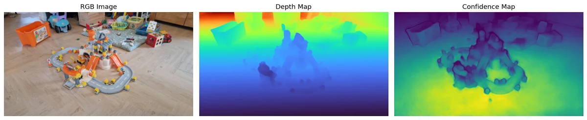
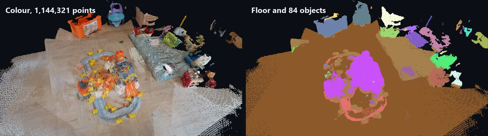
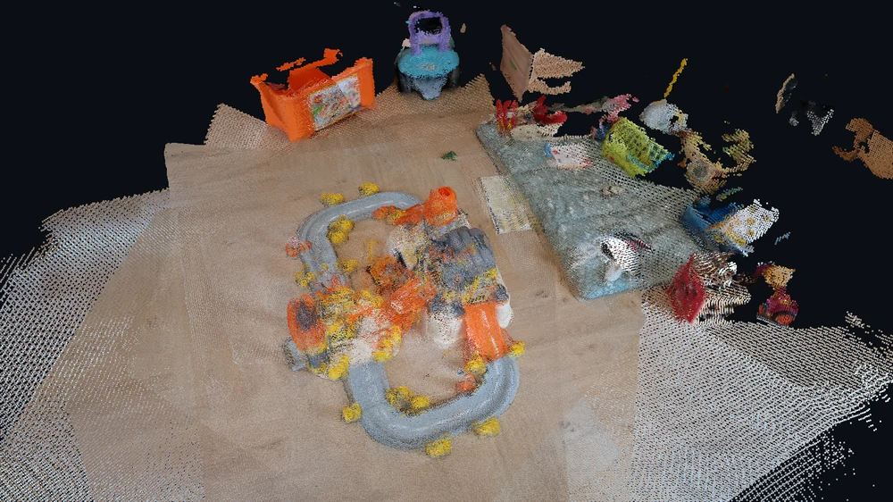

# 3D models from photos with Depth-Anything-3

Depth, camera poses, a registered point cloud, ground and object segmentation, a voxel mesh and a GLB, from nine phone photos.



<sub>Left, three of the nine photos. Right, the point cloud Depth-Anything-3 and the script built from all nine.</sub>

<p>
  <a href="https://learngeodata.eu/materials/3d-models-from-images/"><strong>Get the dataset</strong></a>
  · <a href="https://github.com/florentPoux/3d-reconstruction-depth-anything">The code on GitHub</a> · <a href="https://medium.com/data-science-collective/how-to-generate-3d-models-from-images-with-python-b92b7d549801">Read the article</a>
  · <a href="https://learngeodata.eu/book/">The book</a>
</p>

---

**The code for this kit lives in its own repository:
[florentPoux/3d-reconstruction-depth-anything](https://github.com/florentPoux/3d-reconstruction-depth-anything).** It has been there since
the article came out, with its own stars, forks and links, so it stays there.
This folder carries what a repository of code cannot: where to get the scene the
article was run on, the reference output to check yours against, and the exact
settings that produced it.

## What it does

Feeds nine overlapping phone photos to Depth-Anything-3, which returns a depth map, a confidence map and a camera pose for each one. The script back-projects them into a single point cloud (1,270,080 points), removes outliers with a KD-tree, refines the alignment of every frame with ICP, finds the floor with a NumPy RANSAC, splits what stands on it into objects with voxel connected components, and exports a colour and a segmentation voxel mesh, a GLB scene and one `.npz` bundle with every array. That bundle is the input of the [scene-labeling kit](../3d-scene-labeling-gui). The reference run took **21 seconds on an RTX 3090** with 1.9 GB of GPU memory.



<sub>Step 3: one photo, the depth Depth-Anything-3 predicts for it, and how sure it is.</sub>


## Run it

```bash
git clone https://github.com/florentPoux/3d-reconstruction-depth-anything.git
cd 3d-reconstruction-depth-anything
pip install -r https://raw.githubusercontent.com/florentPoux/3d-data-materials/main/3d-models-from-images/requirements.txt
```

Want PyTorch on your GPU? Install the CUDA build from
[pytorch.org](https://pytorch.org/get-started/locally/) first; pip keeps it.

Download `kids_photos.zip` from the [kit page](https://learngeodata.eu/materials/3d-models-from-images/)
and unzip it inside the clone, so the nine photos sit in `data/KIDS/`. Then
set `SCENE = "KIDS"` at the top of `da_3d_reconstruction.py` and run it, cell
by cell or in one go. Every Open3D window waits for you to close it; in
Step 6, press `Q` without cropping to keep the whole scene, as the reference
run did. Your results land in `results/KIDS/`.

Requires Python 3.10, PyTorch 2, Depth-Anything-3, numpy below 2, scipy, open3d, matplotlib. A CUDA GPU is recommended, not required. The full dependency list is
[requirements.txt](./requirements.txt) in this folder; the code repository keeps
its own at [florentPoux/3d-reconstruction-depth-anything/requirements.txt](https://github.com/florentPoux/3d-reconstruction-depth-anything/blob/main/requirements.txt).

## How the reference output was made

The reference files come from one run on 2026-09-25, with the script
exactly as published except for three lines:

| Line in `da_3d_reconstruction.py` | Published | Reference run |
|---|---|---|
| `SCENE` | `"MY_SCENE"` | `"KIDS"` |
| `load_da3_model()` | `DA3NESTED-GIANT-LARGE` | `load_da3_model("depth-anything/DA3-BASE")` |
| `infer_gs=` in Step 3 | `True` | `False`, and Step 13 skips `export_to_gs_ply` |

**Why DA3-BASE.** The default `DA3NESTED-GIANT-LARGE` weights are licensed
**CC BY-NC 4.0** (non-commercial), and so is what you make with them. The
`DA3-BASE` weights are **Apache-2.0**, which is why the files in this kit
carry no such restriction. DA3-BASE has no Gaussian head, so it cannot
write the Gaussian-splat PLY of Step 13; everything else runs unchanged.
Keep the default when you want the splats and your use is non-commercial.

Run on an RTX 3090 with torch 2.10 and numpy 1.26: 9 frames at 504 x 280,
1,270,080 points merged, 1,144,321 after ICP and cleaning, the floor plane
holds 74.9 % of them, 84 object clusters, 21.2 s end to end, 1.9 GB of GPU
memory at peak. A second run, from a fresh clone of the repository and
the unzipped `kids_photos.zip`, gave byte-identical files.


## The result



<sub>Steps 9 to 11: the floor in earth tones, 84 objects each in its own colour.</sub>



<sub>reconstruction.ply, 1,144,321 points with colour, segment label and ground flag.</sub>


## What is in the kit

| File | Where | What |
|---|---|---|
| [`da_3d_reconstruction.py`](https://github.com/florentPoux/3d-reconstruction-depth-anything/blob/main/da_3d_reconstruction.py) | [florentPoux/3d-reconstruction-depth-anything](https://github.com/florentPoux/3d-reconstruction-depth-anything) | The 14-step pipeline, from photos to a GLB scene and a reusable .npz. |
| `requirements.txt` | here | Everything a fresh environment needs to run the code. |
| `kids_photos.zip` | [kit page](https://learngeodata.eu/materials/3d-models-from-images/) | Nine phone photos of a toy construction set, 4000 x 2252, EXIF removed, 21 MB. |
| `reconstruction_data.npz` | [kit page](https://learngeodata.eu/materials/3d-models-from-images/) | Depth, confidence, cameras, images and 1,270,080 points. The scene-labeling kit starts here. 44 MB. |
| `kids_reconstruction_preview.glb` | [kit page](https://learngeodata.eu/materials/3d-models-from-images/) | The cleaned point cloud, downsampled to 250,000 points, to open in any glTF viewer. 4 MB. |

The data and outputs are served from the kit page rather than committed to git,
where every byte would stay in the history for good.

## Go deeper

This is one pipeline. [3D Data Science with Python](https://learngeodata.eu/book/) is the discipline
underneath it: 690 pages from the Python foundations through point
cloud processing, meshing and the engineering that keeps a 3D workflow standing
up in production. Published by O'Reilly Media in 2025.

## License

Code: MIT, in [florentPoux/3d-reconstruction-depth-anything](https://github.com/florentPoux/3d-reconstruction-depth-anything). This folder is
covered by this repository's [LICENSE](../LICENSE). The data and reference
outputs are distributed from the kit page under their own terms, listed in
[DATA_LICENSE.md](../DATA_LICENSE.md), and are not covered by either license.

Data attribution: Photos by Florent Poux, 2026, every EXIF field removed. Reference outputs computed with Depth-Anything-3 (ByteDance Seed, Apache-2.0 code) and the DA3-BASE weights (Apache-2.0).

## Author

**Dr. Florent Poux**, Founder and Lead Instructor at the 3D Geodata Academy.
[learngeodata.eu](https://learngeodata.eu) · [ORCID 0000-0001-6368-4399](https://orcid.org/0000-0001-6368-4399) · [Medium](https://medium.com/@florentpoux)
