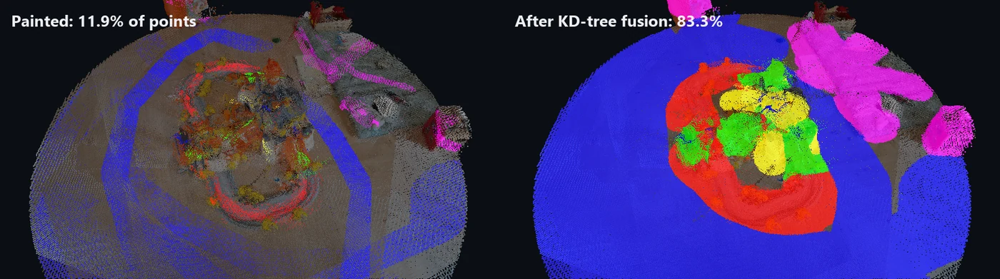
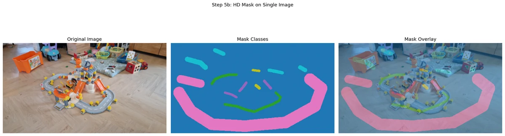
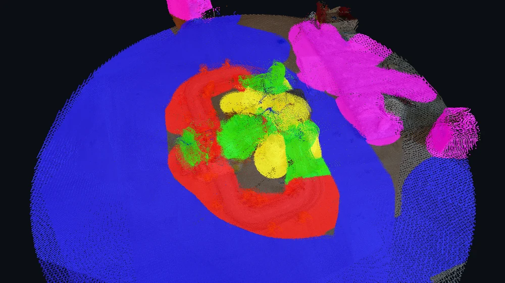

# Label a 3D scene by painting on photos

Paint labels on photos with an OpenCV brush, project them to 3D through the cameras, spread them with a KD-tree, export PLY and GLB. CPU only.



<sub>Left, what 55 brush strokes reach through the cameras: 11.9 % of the points. Right, after KD-tree fusion: 83.3 %.</sub>

<p>
  <a href="https://learngeodata.eu/materials/3d-scene-labeling-gui/"><strong>Get the dataset</strong></a> · <a href="https://medium.com/data-science-collective/how-to-build-a-python-gui-for-3d-scene-labeling-49dd43624a7f">Read the article</a> · <a href="https://medium.com/@florentpoux">More tutorials</a>
  · <a href="https://learngeodata.eu/book/">The book</a>
</p>

---

## What it does

Opens each photo in an OpenCV window where you paint up to five classes with a brush. Every painted pixel is back-projected through its camera into the 3D scene and matched to the nearest point within 1 cm; then a KD-tree built on the labeled points hands each label to its unlabeled neighbours by majority vote. On the KIDS scene, 55 strokes on five photos label 151,398 of 1,270,080 points directly (11.9 %) and 1,058,457 after fusion (83.3 %). The result is a PLY with a `segment_label` field that CloudCompare reads as a scalar field, and a GLB with the camera frustums for any glTF viewer. The brush module the article says ships with the materials, `interactive_painting.py`, is the original from February 2026, recovered on 2026-09-25 and published here for the first time.



<sub>Step 2: one photo, the mask painted on it, and the overlay that shows where each class landed.</sub>


## Run it

```bash
pip install -r requirements.txt
python da_semantic_masking.py        # you paint, in an OpenCV window
```

Download `reconstruction_data.npz` from the [kit page](https://learngeodata.eu/materials/3d-scene-labeling-gui/),
or make your own with the [3d-models-from-images](../3d-models-from-images)
kit, and put it next to the script. In the painting window, `1` to `5`
pick the class, `+` and `-` resize the brush, `c` clears and `s` keeps the
mask and moves on. Step 2 paints one photo, Step 6 the first five. Every
Open3D window waits for you to close it.

No screen, or want my exact result? Replay the strokes of the reference run:

```bash
python run_headless.py                      # replays kids_strokes.json
python run_headless.py --batch-size 20000   # same labels, less RAM
```

It runs the tutorial unchanged, with the brush driven by
`kids_strokes.json` instead of your mouse. Figures go to
`results/KIDS/figures/`, and every painted mask is saved as `.npy` in
`results/KIDS/masks/`, which is how you carry masks painted on a laptop
to a machine without a screen.

Requires Python 3.10, numpy, scipy, open3d, matplotlib, opencv-python, trimesh 4 or newer, and a screen for the painting window.

## How the reference output was made

The reference files come from `python run_headless.py --batch-size 20000`
on 2026-09-25, on a CPU (numpy 2.2, open3d 0.19, trimesh 4): six painting
calls (Step 2 on photo 0, then Step 6 on photos 0 to 4), 55 strokes, and
122.8 s end to end, much of it in the point-by-point PLY writer.

| Class | Painted | After fusion |
|---|---:|---:|
| 1 road track | 10,919 | 165,918 |
| 2 orange ramps and slides | 4,181 | 78,281 |
| 3 wooden floor | 124,118 | 657,956 |
| 4 white base and buildings | 2,510 | 63,566 |
| 5 background clutter | 9,670 | 92,736 |
| **Total** | **151,398 (11.9 %)** | **1,058,457 (83.3 %)** |

The batch size only bounds memory: every unlabeled point votes on its own
neighbours, so the labels are the same at any batch size. At the article's
100000 the fusion step went past 6 GB of RAM here; at 20000 the whole run
peaked at 2.3 GB.

A second run, from this folder copied into a fresh virtual environment
built from `requirements.txt` alone (numpy 2.2, open3d 0.20, opencv 5.0,
trimesh 5.1) and at a batch size of 50000, wrote a byte-identical PLY and
the same labels, point for point. Its GLB holds the same points, colours
and frustums; 32 bytes of trimesh metadata differ.

The input is the bundle the [3d-models-from-images](../3d-models-from-images)
kit writes (Depth-Anything-3 with the Apache-2.0 DA3-BASE weights). The
article's own counts (847,392 points and 15 frames in one place, about
1.2 million points and 8 photos in another) come from earlier runs, and
several of its label renders show another scene, a car. This kit's
numbers are the ones you will reproduce.


## The result



<sub>smart_fused_labels-v2.ply: red track, green ramps, blue floor, yellow base, magenta background.</sub>


## What is in the kit

| File | Where | What |
|---|---|---|
| `da_semantic_masking.py` | here | Load, paint, project, fuse and export, in the article's 11 cells. |
| `interactive_painting.py` | here | The OpenCV brush tool the script paints with, 1-5 for the class, +/- for the brush. |
| `run_headless.py` | here | The same run with no screen, replaying recorded brush strokes. |
| `kids_strokes.json` | here | The brush strokes of the reference run, five classes on five photos. |
| `reconstruction_data.npz` | [kit page](https://learngeodata.eu/materials/3d-scene-labeling-gui/) | The KIDS reconstruction from the 3d-models-from-images kit, 9 frames and 1,270,080 points. 44 MB. |
| `smart_fused_labels-v2.ply` | [kit page](https://learngeodata.eu/materials/3d-scene-labeling-gui/) | All 1,270,080 points with their colour and a segment_label field CloudCompare reads as a scalar field. 24 MB. |
| `semantic_scene.glb` | [kit page](https://learngeodata.eu/materials/3d-scene-labeling-gui/) | The labeled scene with the nine camera frustums, for any glTF viewer. 20 MB. |

The datasets are served from the kit page rather than committed here, because a
20 MB point cloud does not belong in git history.

## Go deeper

This is one pipeline. [3D Data Science with Python](https://learngeodata.eu/book/) is the discipline
underneath it: 690 pages from the Python foundations through point
cloud processing, meshing and the engineering that keeps a 3D workflow standing
up in production. Published by O'Reilly Media in 2025.

New to this? [The free 3D mission](https://learngeodata.eu/free-mission/) builds the point
cloud foundations this script leans on, in Python, at no cost.

## License

Code: MIT, see [LICENSE](../LICENSE). The dataset is distributed from the kit
page under its own terms, listed in [DATA_LICENSE.md](../DATA_LICENSE.md), and is
not covered by this repository's license.

## Author

**Dr. Florent Poux**, Founder and Lead Instructor at the 3D Geodata Academy.
[learngeodata.eu](https://learngeodata.eu) · [ORCID 0000-0001-6368-4399](https://orcid.org/0000-0001-6368-4399) · [Medium](https://medium.com/@florentpoux)
