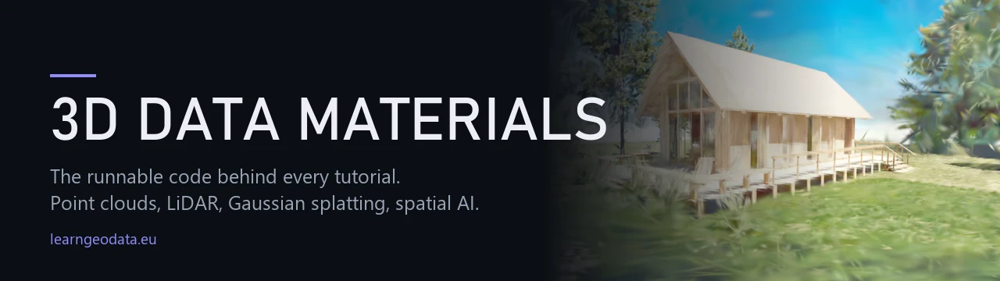
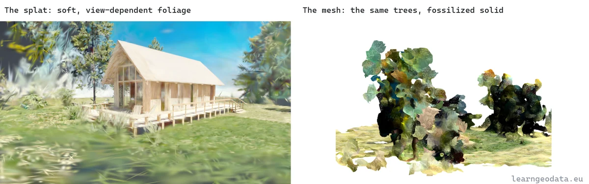
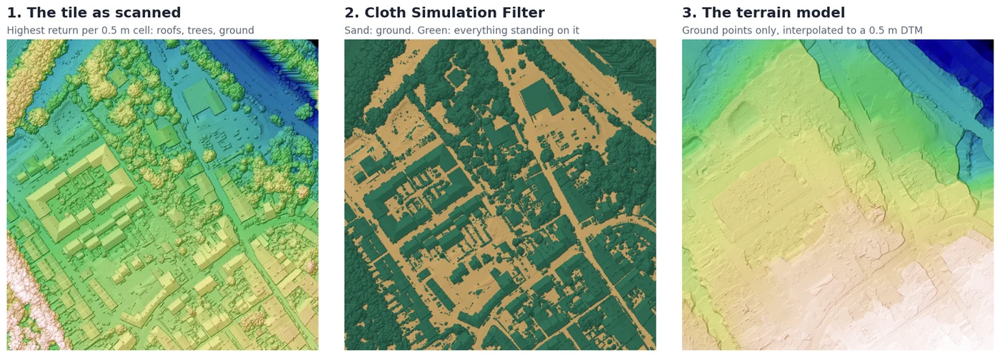

<p align="center">
  
</p>

<h1 align="center">3D Data Materials</h1>

<p align="center">
  <strong>The runnable code behind every 3D data science tutorial I publish.</strong><br>
  Point clouds, LiDAR, Gaussian splatting, meshing and spatial AI, in Python you can read.
</p>

<p align="center">
  
  
  
  
</p>

<p align="center">
  <a href="https://learngeodata.eu/materials/">Datasets</a> ·
  <a href="https://learngeodata.eu/blog/">Tutorials</a> ·
  <a href="https://learngeodata.eu/book/">The book</a> · <a href="https://medium.com/@florentpoux">Medium</a> ·
  <a href="https://learngeodata.eu/about/">About</a>
</p>

---

## What this is

Every tutorial I write ships with a script that actually runs. This repository is
where those scripts live, one folder per article, each one self-contained and
commented for reading rather than for cleverness.

No framework, no package to install from here, no abstraction layer between you
and the geometry. Each folder is a single file you can open, read top to bottom,
and run.

The datasets are separate, because a 20 MB point cloud does not belong in git
history. Each kit's page on learngeodata.eu hands you the scene the script was
written against, plus the finished output so you can check your result against
mine.

## The kits


### [Gaussian splat to textured mesh](./gaussian-splat-to-mesh)

<a href="./gaussian-splat-to-mesh"></a>
Filter, densify and Poisson-mesh a trained 3D Gaussian splat, then bake a real texture. CPU only.

- Code: [`gaussian-splat-to-mesh/`](./gaussian-splat-to-mesh)
- Data: [learngeodata.eu/materials/gaussian-splat-to-mesh/](https://learngeodata.eu/materials/gaussian-splat-to-mesh/)
- Article: [Gaussian splat to textured mesh](https://medium.com/@florentpoux/turn-3d-gaussian-splatting-into-a-textured-mesh-python-no-gpu-5fb461b3d34a)

<br clear="right">

### [LiDAR ground filtering to a terrain model](./lidar-ground-to-dtm)

<a href="./lidar-ground-to-dtm"></a>
Read, thin and index a real LiDAR tile, filter the ground, grade it against the survey, write a DTM. CPU only.

- Code: [`lidar-ground-to-dtm/`](./lidar-ground-to-dtm)
- Data: [learngeodata.eu/materials/lidar-ground-to-dtm/](https://learngeodata.eu/materials/lidar-ground-to-dtm/)
- Article: [LiDAR ground filtering to a terrain model](https://medium.com/data-science-collective/the-practical-field-guide-to-lidar-point-cloud-processing-f7c3b8ef6d50)

<br clear="right">


## How to use one

```bash
git clone https://github.com/florentPoux/3d-data-materials.git
cd 3d-data-materials/gaussian-splat-to-mesh
pip install -r requirements.txt
```

Download the dataset from that kit's page, drop it next to the script, and run it.
Each script prints its numbers as it goes, so you can compare against the article
at every step rather than only at the end.

## Questions this repository answers

- **How do I convert a 3D Gaussian splat into a textured mesh in Python?** See
  [gaussian-splat-to-mesh](./gaussian-splat-to-mesh). Filtering, spherical
  harmonics to RGB, ellipsoid sampling, Poisson reconstruction and a real texture
  bake. Runs on a CPU.
- **How do I separate ground from a LiDAR point cloud and build a DTM in Python?**
  See [lidar-ground-to-dtm](./lidar-ground-to-dtm). laspy, Open3D and a Cloth
  Simulation Filter on a real IGN LiDAR HD tile, graded against the survey's own
  ground class, then a GeoTIFF terrain model. No PDAL needed.
- **Do I need a GPU for 3D reconstruction work?** For training a splat, yes.
  For everything downstream of the trained file, no. The pipelines here are
  classic geometry processing and run on a laptop.
- **Where do the datasets come from?** Real captures, not toy data. Each kit
  names its scene and its size on the kit page.
- **Can I use this code at work?** Yes. MIT licensed, see [LICENSE](./LICENSE).
  Attribution is appreciated, not required.

## Who wrote this

Dr. Florent Poux is the founder and lead instructor of the 3D Geodata Academy and the author of 3D Data Science with Python (O'Reilly Media, 2025). He holds a PhD in Sciences from the University of Liege, where he was formerly an adjunct professor in 3D geodata, and has spent 15+ years on the automation of reality capture, from point clouds and photogrammetry to spatial AI. His research carries 1,700+ Google Scholar citations across 60+ peer-reviewed publications.

- Website: [learngeodata.eu](https://learngeodata.eu)
- Book: [3D Data Science with Python](https://learngeodata.eu/book/) (O'Reilly Media, 2025), 690 pages
- ORCID: [0000-0001-6368-4399](https://orcid.org/0000-0001-6368-4399)
- Google Scholar: [1,700+ citations](https://scholar.google.com/citations?user=eoyJ6eYAAAAJ&hl=en)
- LinkedIn: [www.linkedin.com/in/florent-poux-point-cloud](https://www.linkedin.com/in/florent-poux-point-cloud/)
- YouTube: [www.youtube.com/@FlorentPoux](https://www.youtube.com/@FlorentPoux)
- Medium: [medium.com/@florentpoux](https://medium.com/@florentpoux)

## Learn the whole thing

These scripts are the endings of articles, not a curriculum. If you want the path
rather than the pieces:

- [The free 3D mission](https://learngeodata.eu/free-mission/), hands-on point cloud
  processing in Python, no cost.
- [3D Data Science with Python](https://learngeodata.eu/book/), the structured version, 690 pages.
- [The 3D Geodata Academy](https://learngeodata.eu/resources/), courses for the parts you
  want to go deep on.

## Citing this work

If this code supports something you publish, please cite it. See
[CITATION.cff](./CITATION.cff), or:

> Poux, Florent. (2026). *3D Data Materials: runnable code for 3D
> data science tutorials*. 3D Geodata Academy.
> https://github.com/florentPoux/3d-data-materials

## License

Code in this repository is MIT licensed. See [LICENSE](./LICENSE).

Datasets are distributed from their kit pages under their own terms, listed in
[DATA_LICENSE.md](./DATA_LICENSE.md). They are not covered by this repository's
license.

---

<p align="center">
  <sub>Maintained by Dr. Florent Poux · <a href="https://learngeodata.eu">learngeodata.eu</a></sub>
</p>
