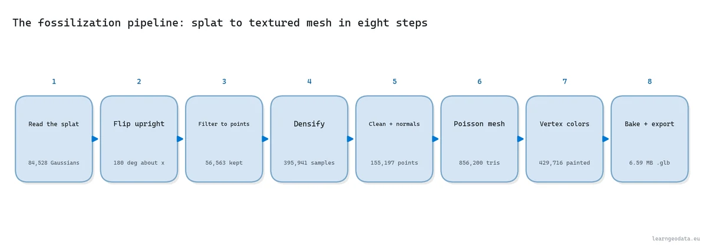
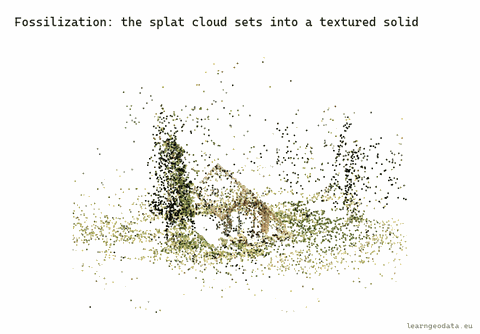
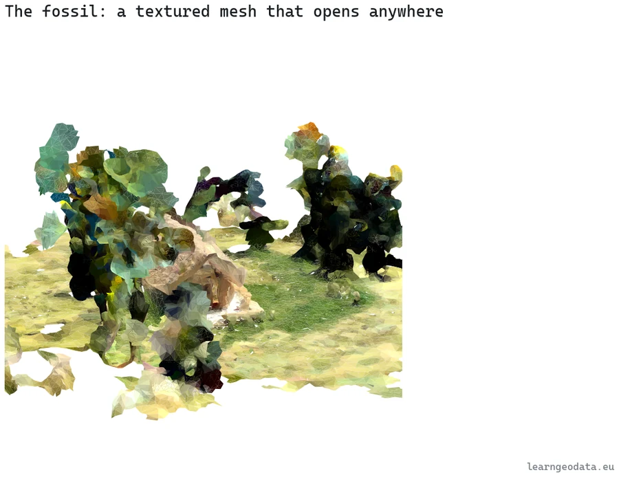

# Gaussian splat to textured mesh

Filter, densify and Poisson-mesh a trained 3D Gaussian splat, then bake a real texture. CPU only.


<sub>Left, the splat: photoreal and locked to its renderer. Right, the mesh: solid, textured, yours.</sub>

<p>
  <a href="https://learngeodata.eu/materials/gaussian-splat-to-mesh/"><strong>Get the dataset</strong></a> · <a href="https://medium.com/@florentpoux/turn-3d-gaussian-splatting-into-a-textured-mesh-python-no-gpu-5fb461b3d34a">Read the article</a> · <a href="https://medium.com/@florentpoux">More tutorials</a>
  · <a href="https://learngeodata.eu/book/">The book</a>
</p>

---

## What it does

Takes a trained 3D Gaussian splat and returns a solid, textured `.glb` you can open in Blender, measure, edit and print. Training the splat needs a GPU. Everything here does not: it is classic geometry processing, and the run in the article took **93 seconds on a laptop with no graphics card**.



<sub>The eight steps, each one a function in the script.</sub>


## Run it

```bash
pip install -r requirements.txt
python splat_to_textured_mesh.py
```

Download the scene from the [kit page](https://learngeodata.eu/materials/gaussian-splat-to-mesh/), put
it next to the script, and run. Every step prints its own numbers, so you can
check them against the article as you go instead of only at the end.

Requires Python 3.10, numpy, scipy, plyfile, open3d, trimesh, xatlas, pillow, matplotlib.


## The result



<sub>The whole pipeline in four seconds.</sub>



<sub>cabin_textured.glb, 79,999 triangles with a 2048px texture baked in.</sub>


## What is in the kit

| File | Where | What |
|---|---|---|
| `splat_to_textured_mesh.py` | here | The nine-function pipeline, start to finish. |
| `cabin_in_the_forest.ply` | [kit page](https://learngeodata.eu/materials/gaussian-splat-to-mesh/) | The trained splat, 84,528 Gaussians, 20 MB. |
| `cabin_textured.glb` | [kit page](https://learngeodata.eu/materials/gaussian-splat-to-mesh/) | The finished mesh, so you can check your result against mine. |

The datasets are served from the kit page rather than committed here, because a
20 MB point cloud does not belong in git history.

## Go deeper

This is one pipeline. [3D Data Science with Python](https://learngeodata.eu/book/) is the discipline
underneath it: 690 pages from the Python foundations through point
cloud processing, meshing and the engineering that keeps a 3D workflow standing
up in production. Published by O'Reilly Media in 2025.

New to this? [The free 3D mission](https://learngeodata.eu/free-mission/) builds the point
cloud foundations this script leans on, in Python, at no cost.

## License

Code: MIT, see [LICENSE](../LICENSE). The dataset is distributed from the kit
page under its own terms, listed in [DATA_LICENSE.md](../DATA_LICENSE.md), and is
not covered by this repository's license.

## Author

**Dr. Florent Poux**, Founder and Lead Instructor at the 3D Geodata Academy.
[learngeodata.eu](https://learngeodata.eu) · [ORCID 0000-0001-6368-4399](https://orcid.org/0000-0001-6368-4399) · [Medium](https://medium.com/@florentpoux)
