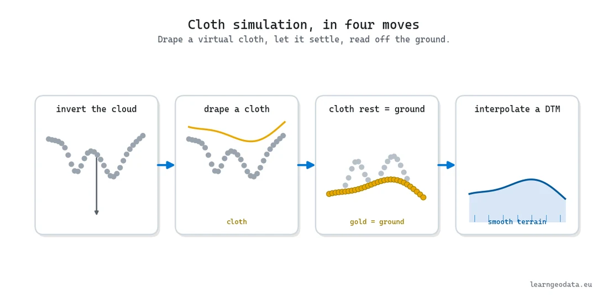
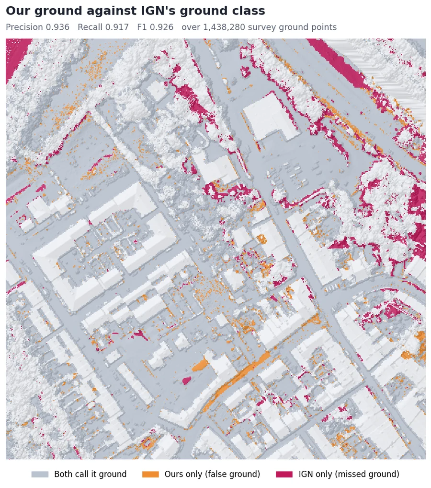
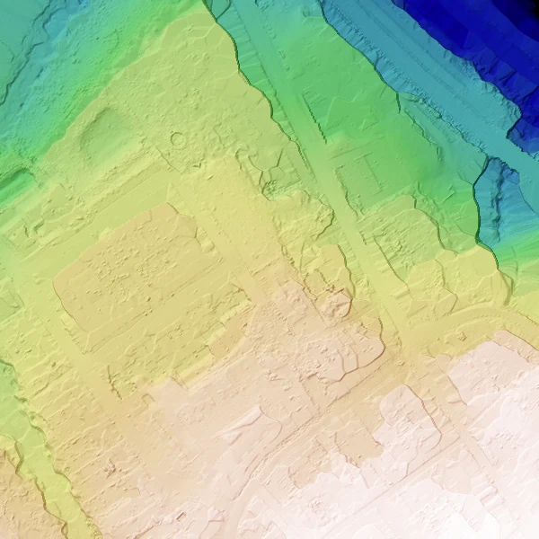

# LiDAR ground filtering to a terrain model

Read, thin and index a real LiDAR tile, filter the ground, grade it against the survey, write a DTM. CPU only.


<sub>Left, the tile as scanned. Middle, the ground the cloth found. Right, the 0.5 m terrain model.</sub>

<p>
  <a href="https://learngeodata.eu/materials/lidar-ground-to-dtm/"><strong>Get the dataset</strong></a> · <a href="https://medium.com/data-science-collective/the-practical-field-guide-to-lidar-point-cloud-processing-f7c3b8ef6d50">Read the article</a> · <a href="https://medium.com/@florentpoux">More tutorials</a>
  · <a href="https://learngeodata.eu/book/">The book</a>
</p>

---

## What it does

Reads a 300 x 300 m crop of an IGN LiDAR HD tile (3.8 million points, Lambert-93) with laspy, thins it on a voxel grid and queries a KD-tree, as in the field guide. Then it does what the guide only describes: a Cloth Simulation Filter separates the ground, the result is **graded against the ground class IGN's own surveyors assigned** (precision 0.936, recall 0.917), and the ground becomes a 0.5 m terrain model as a GeoTIFF, a hillshade and a ground-only `.laz`. The whole run takes **about 7 seconds on a CPU**, no PDAL needed.



<sub>Cloth Simulation Filter: flip the cloud, drop a cloth on it, keep what it rests on.</sub>


## Run it

```bash
pip install -r requirements.txt
python lidar_ground_to_dtm.py
```

Download the scene from the [kit page](https://learngeodata.eu/materials/lidar-ground-to-dtm/), put
it next to the script, and run. Every step prints its own numbers, so you can
check them against the article as you go instead of only at the end.

Requires Python 3.10, numpy, scipy, laspy with lazrs, open3d, cloth-simulation-filter, rasterio, matplotlib.


## The result



<sub>Graded against IGN: misses sit on the steep wooded banks, false ground on low vegetation.</sub>



<sub>dtm.tif as a hillshade, 600 x 600 cells at 0.5 m.</sub>


## What is in the kit

| File | Where | What |
|---|---|---|
| `lidar_ground_to_dtm.py` | here | Read, thin, index, ground filter, grade, DTM, height above ground. |
| `lidar_hd_tile.laz` | [kit page](https://learngeodata.eu/materials/lidar-ground-to-dtm/) | 300 x 300 m of IGN LiDAR HD, 3,830,133 points with IGN's classes, 21 MB. |
| `dtm.tif` | [kit page](https://learngeodata.eu/materials/lidar-ground-to-dtm/) | The 0.5 m terrain model (GeoTIFF, EPSG:2154) the script should reproduce. |
| `ground.laz` | [kit page](https://learngeodata.eu/materials/lidar-ground-to-dtm/) | The 1,409,542 points the filter called ground, IGN's class kept on each. |

The datasets are served from the kit page rather than committed here, because a
20 MB point cloud does not belong in git history.

## Go deeper

This is one pipeline. [3D Data Science with Python](https://learngeodata.eu/book/) is the discipline
underneath it: 690 pages from the Python foundations through point
cloud processing, meshing and the engineering that keeps a 3D workflow standing
up in production. Published by O'Reilly Media in 2025.

New to this? [The free 3D mission](https://learngeodata.eu/free-mission/) builds the point
cloud foundations this script leans on, in Python, at no cost.

## License

Code: MIT, see [LICENSE](../LICENSE). The dataset is distributed from the kit
page under its own terms, listed in [DATA_LICENSE.md](../DATA_LICENSE.md), and is
not covered by this repository's license.

Data attribution: IGN, LiDAR HD point cloud, tile LHD_FXX_0584_6264 (Lambert-93, IGN69), cropped to 300 x 300 m. Licence Ouverte / Open Licence 2.0 (Etalab).

## Author

**Dr. Florent Poux**, Founder and Lead Instructor at the 3D Geodata Academy.
[learngeodata.eu](https://learngeodata.eu) · [ORCID 0000-0001-6368-4399](https://orcid.org/0000-0001-6368-4399) · [Medium](https://medium.com/@florentpoux)
