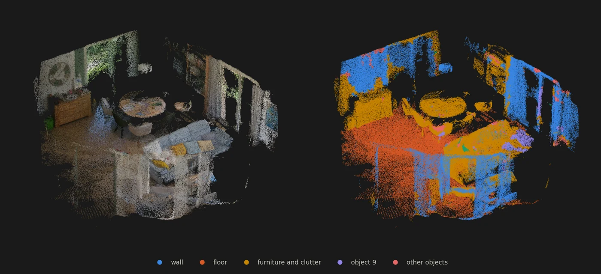
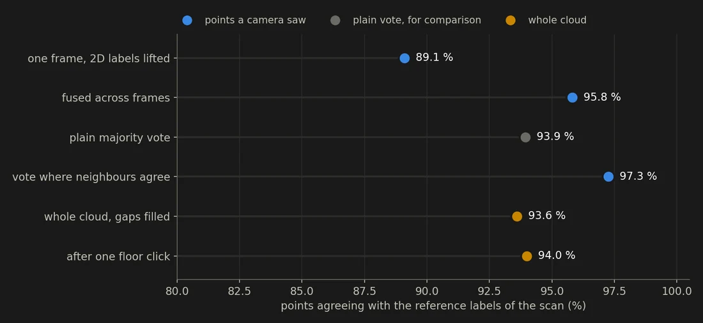
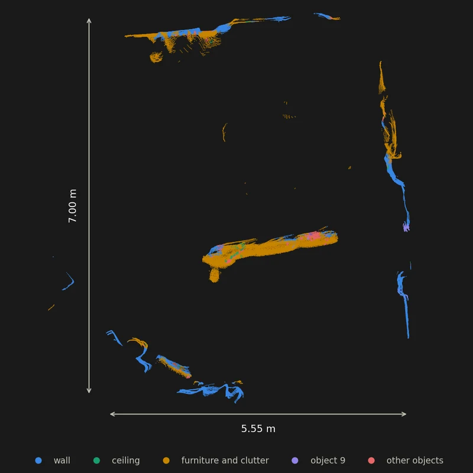

# Open-vocabulary 3D semantics on a real room scan

Lift 2D labels onto a real room scan, fuse them across cameras, vote out the flicker, slice a plan. CPU only; model outputs simulated.



<sub>Left, the scan as captured. Right, the labels after lifting, fusion, the vote and one click (ceiling cut away).</sub>

<p>
  <a href="https://learngeodata.eu/materials/open-vocabulary-3d-semantics/"><strong>Get the dataset</strong></a> · <a href="https://medium.com/data-science-collective/turn-video-into-smart-3d-models-the-python-guide-with-sam-clip-and-dino-f4878d4c37dc">Read the article</a> · <a href="https://medium.com/@florentpoux">More tutorials</a>
  · <a href="https://learngeodata.eu/book/">The book</a>
</p>

---

## What it does

Loads a real handheld scan of a living room (1 million points, colour and a class on every point), levels it on the floor with RANSAC, scales it from the ceiling, and builds the pixel-to-point link with a depth test. Then it runs the half of the article that lives in 3D: per-frame label maps are lifted through that link, fused across 36 views, cleaned by a k-NN vote, fixed with one seed click, and sliced into a floor plan. **Be clear on what this is: SAM, CLIP and DINOv2 are not run.** The scan ships without its video frames, so the cameras are virtual and the 2D model outputs are simulated from the scan's own classes with injected errors. Everything after them is real, and so is every number: fusion takes the labels from 89.1 % to 95.8 % right, the vote to 97.3 %, measured against the scan. `predict_2d_labels()` and `predict_2d_match()` are the plug-in points, with the array shapes in the script header. **About 3 seconds on a CPU.**



<sub>Measured on the scan: fusion across views does the heavy lifting; a plain vote loses ground, a gated one gains it.</sub>


## Run it

```bash
pip install -r requirements.txt
python open_vocab_3d_semantics.py
```

Download the scene from the [kit page](https://learngeodata.eu/materials/open-vocabulary-3d-semantics/), put
it next to the script, and run. Every step prints its own numbers, so you can
check them against the article as you go instead of only at the end.

Requires Python 3.10, numpy, scipy, matplotlib, plyfile.


## The result



<sub>The 30 cm slab at 1 m, turned to the walls. Metres assume a 2.5 m ceiling.</sub>


## What is in the kit

| File | Where | What |
|---|---|---|
| `open_vocab_3d_semantics.py` | here | The nine steps plus the per-class query, with the real and simulated parts marked. |
| `dataviz.py` | here | The loader and step figures the script imports. Stops with a fix if a file or a library is missing. |
| `room.ply` | [kit page](https://learngeodata.eu/materials/open-vocabulary-3d-semantics/) | The living-room scan, thinned to 999,987 points (one per 1.3 cm voxel) with colour and a class on each, 19 MB. |
| `room_labeled.ply` | [kit page](https://learngeodata.eu/materials/open-vocabulary-3d-semantics/) | The 40,000 working points, levelled and in metres, with the pipeline's label and the reference class on each. |
| `floorplan_slice.ply` | [kit page](https://learngeodata.eu/materials/open-vocabulary-3d-semantics/) | The 30 cm slab at 1 m, the plan slice your run should reproduce. |
| `class_stats.csv` | [kit page](https://learngeodata.eu/materials/open-vocabulary-3d-semantics/) | Per-class points, heights, footprint along the walls and agreement with the reference. |

The datasets are served from the kit page rather than committed here, because a
20 MB point cloud does not belong in git history.

## Go deeper

This is one pipeline. [3D Data Science with Python](https://learngeodata.eu/book/) is the discipline
underneath it: 690 pages from the Python foundations through point
cloud processing, meshing and the engineering that keeps a 3D workflow standing
up in production. Published by O'Reilly Media in 2025.

New to this? [The free 3D mission](https://learngeodata.eu/free-mission/) builds the point
cloud foundations this script leans on, in Python, at no cost.

## License

Code: MIT, see [LICENSE](../LICENSE). The dataset is distributed from the kit
page under its own terms, listed in [DATA_LICENSE.md](../DATA_LICENSE.md), and is
not covered by this repository's license.

## Author

**Dr. Florent Poux**, Founder and Lead Instructor at the 3D Geodata Academy.
[learngeodata.eu](https://learngeodata.eu) · [ORCID 0000-0001-6368-4399](https://orcid.org/0000-0001-6368-4399) · [Medium](https://medium.com/@florentpoux)
